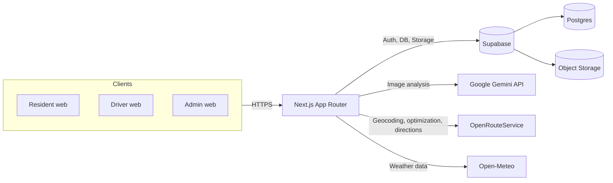
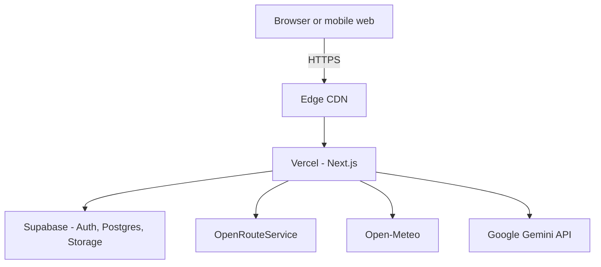

# HakotLahat

Smart, unified web platform for municipal waste collection optimization.

## System Architecture Diagram

## API Documentation

| Method | Path | Auth | Description |
| --- | --- | --- | --- |
| POST | `/api/analyze-waste` | No | Analyze an uploaded waste image with Gemini. |
| POST | `/api/collect-pickup` | Yes | Mark a pickup request as collected and update scores. |
| GET | `/api/geocode` | No | Forward or reverse geocoding via OpenRouteService. |
| GET | `/api/municipalities` | No | List municipalities for onboarding and filters. |
| POST | `/api/optimize-route` | Yes | Optimize a driver route and persist it. |
| GET | `/api/weather-alert-count` | Yes | Count weather warnings for the user municipality. |

### POST /api/analyze-waste
**Request:** `multipart/form-data` with `file` (image/jpeg, image/png, image/webp).  
**Response:** JSON `{ category, priority_score, volume_estimate }`.  
**Notes:** Uses Gemini `gemini-2.5-flash-lite` to classify and estimate volume.

### POST /api/collect-pickup
**Request:** JSON `{ requestId: string }` with an authenticated Supabase session.  
**Response:** JSON `{ success: true }`.  
**Notes:** Updates `pickup_requests.status` to `collected` and upserts `res_score` and `drv_score`.

### GET /api/geocode
**Request (search):** `?type=search&q=Text`  
**Request (reverse):** `?type=reverse&lat=...&lng=...`  
**Response:** JSON `{ features: [{ label, lng, lat }] }`.  
**Notes:** Uses OpenRouteService Geocoding API.

### GET /api/municipalities
**Request:** No parameters.  
**Response:** JSON `{ municipalities: [{ id, name }] }`.

### POST /api/optimize-route
**Request:** JSON `{ driverLat, driverLng, vehicleCapacity?, requestIds: string[] }` with auth.  
**Response:** JSON `{ routeId, stops, coordinates, totalDuration, totalDistance, unassignedCount }`.  
**Notes:** Calls OpenRouteService Optimization and Directions, then inserts a new `routes` row and sets selected `pickup_requests` to `scheduled`.

### GET /api/weather-alert-count
**Request:** No parameters, authenticated session required.  
**Response:** JSON `{ count }`.  
**Notes:** Uses Open-Meteo based on the user's municipality center.

## Database Schema

| Table | Purpose | Key columns |
| --- | --- | --- |
| `municipalities` | Service coverage areas | `id` (uuid, PK), `name`, `center_lat`, `center_lng`, `created_at` |
| `users` | Profile data linked to Supabase Auth | `id` (uuid, PK), `municipality_id` (FK), `role`, `full_name`, `email`, `avatar_url`, `has_onboarded`, `home_lat`, `home_lng`, `home_address`, `total_recycled`, `created_at` |
| `vehicles` | Fleet inventory | `id` (uuid, PK), `municipality_id` (FK), `plate_number`, `capacity_volume`, `status`, `created_at` |
| `driver_sessions` | Active driver status | `id` (uuid, PK), `driver_id` (FK), `vehicle_id` (FK), `current_lat`, `current_lng`, `status`, `last_location_update`, `started_at`, `ended_at` |
| `pickup_requests` | Resident pickup requests | `id` (uuid, PK), `resident_id` (FK), `latitude`, `longitude`, `image_url`, `status`, `priority_score`, `volume_estimate`, `category`, `created_at` |
| `routes` | Optimized driver routes | `id` (uuid, PK), `driver_id` (FK), `status`, `optimized_path` (jsonb), `created_at` |
| `res_score` | Resident gamification | `user_id` (uuid, PK/FK), `eco_points`, `total_recycled`, `updated_at` |
| `drv_score` | Driver performance | `user_id` (uuid, PK/FK), `total_collections`, `drv_points`, `routes_completed`, `total_distance_km`, `updated_at` |

## Deployment Diagram

